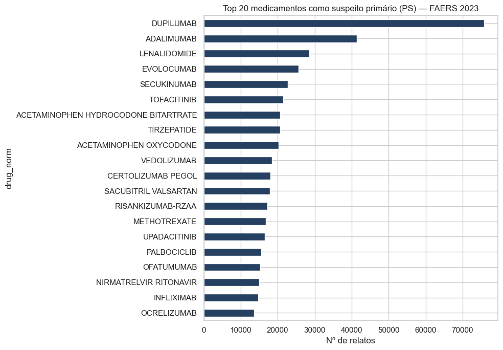
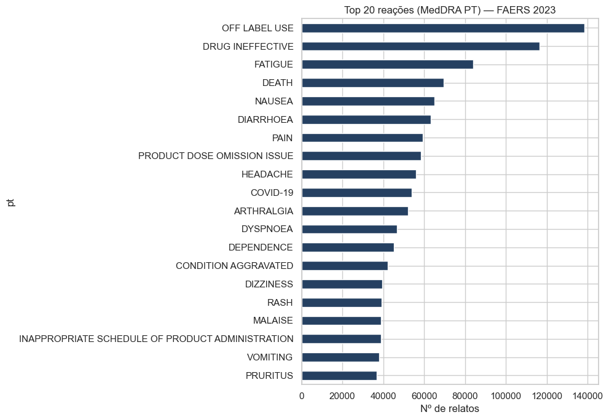
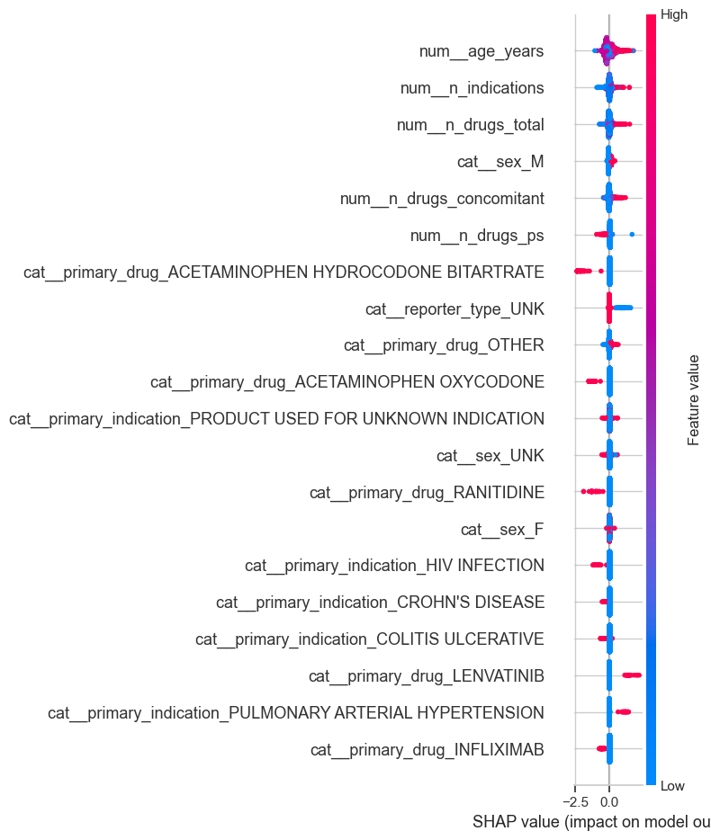
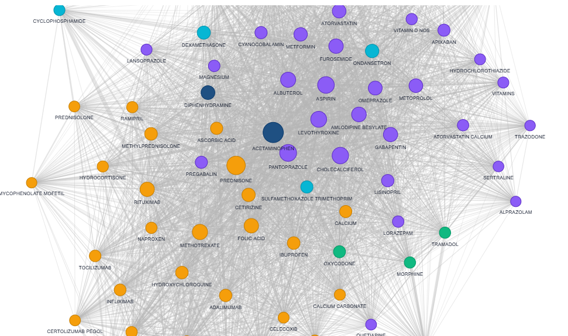

# Painel de Farmacovigilância — Análise de Sinais de Segurança em FAERS

> Pipeline completo de farmacovigilância sobre o FAERS (FDA Adverse Event Reporting System): ingestão e normalização de **~1,5 milhão de relatos** de 2023, detecção de sinais por disproporcionalidade (PRR, ROR, IC), classificação de severidade com XGBoost+SHAP, análise de rede droga–droga (NetworkX + Louvain) e dashboard interativo em Streamlit.

**👉 [Acesse a demo ao vivo](https://farmacovigilancia-faers.streamlit.app/)**

[](https://farmacovigilancia-faers.streamlit.app/)

[](https://www.python.org/)
[](LICENSE)
[](https://scikit-learn.org/)
[](https://xgboost.readthedocs.io/)
[](https://networkx.org/)
[](https://streamlit.io/)

---

## 🎯 Problema

A vigilância pós-comercialização de medicamentos depende da detecção de **sinais de segurança** — combinações droga-reação que ocorrem com frequência inesperadamente alta. Métodos estatísticos clássicos (PRR, ROR, IC) e modelos de ML complementam o processo, mas exigem trabalho não-trivial sobre uma base ruidosa, multi-tabela e gigantesca como o FAERS.

Este projeto constrói um pipeline reprodutível que:

1. **Ingere** os 4 trimestres de 2023 do FAERS (~1,5 M casos únicos)
2. **Limpa e normaliza** nomes de medicamentos, deduplica casos e padroniza desfechos
3. **Detecta sinais** com PRR, ROR e Information Component (com IC 95%)
4. **Prediz severidade** com XGBoost + SHAP
5. **Modela a rede** de drogas frequentemente co-reportadas
6. **Apresenta tudo** em um dashboard Streamlit com 4 abas

## 📊 Dataset

| Tabela | Linhas | Conteúdo |
|---|---:|---|
| DEMO | 1.673.637 → **1.544.991** após dedup | demografia + identificação do caso |
| DRUG | 7.473.722 | medicamentos por caso |
| REAC | 5.843.817 | reações (MedDRA preferred term) |
| OUTC | 1.247.923 | desfechos (DE, LT, HO, DS, CA, RI, OT) |
| INDI | 4.521.741 | indicações de uso |
| THER | 2.587.650 | datas de terapia |
| RPSR | 52.497 | tipo de reportante |

**~23 milhões de linhas no total · 57.415 drogas únicas após normalização**

- **Fonte:** [FAERS Quarterly Data Files (FDA)](https://fis.fda.gov/extensions/FPD-QDE-FAERS/FPD-QDE-FAERS.html)
- **Período:** 2023 Q1–Q4

## 🧪 Abordagem

| # | Notebook | Técnicas | Entregável |
|---|---|---|---|
| 01 | `01_eda.ipynb` | Exploração multi-tabela, qualidade dos dados | 4 figuras + decisões de pipeline |
| 03 | `03_disproportionality.ipynb` | **PRR + ROR + IC** com IC95% | 251.759 pares avaliados |
| 04 | `04_severity_model.ipynb` | XGBoost + Optuna + SHAP | Modelo + interpretabilidade |
| 05 | `05_network_analysis.ipynb` | NetworkX + Louvain | Grafo + comunidades |
| app | `app/streamlit_app.py` | Dashboard integrado | 4 abas interativas |

---

## 📈 Resultados

### 🔬 1. Detecção de sinais — validação contra a literatura ✅

| Métrica | Valor |
|---|---:|
| Pares droga–reação avaliados (`a ≥ 3`) | **251.759** |
| Sinais positivos PRR (PRR≥2, χ²≥4) | 121.607 |
| Sinais positivos ROR (IC95% inf >1) | 133.137 |
| Sinais positivos IC (IC025>0, mais conservador) | 43.693 |

**Associações conhecidas recuperadas pelo método** — todas com sinal forte:

| Associação clássica | a | PRR | IC | Confirmado? |
|---|---:|---:|---:|:---:|
| Warfarin → Hemorragia GI | 43 | **43,5** | 4,86 | ✅ |
| Warfarin → Hemorragia intracraniana | 12 | **59,2** | 4,15 | ✅ |
| Warfarin → Hemorragia retroperitoneal | 6 | **224,2** | 3,62 | ✅ |
| Metformin → Acidose láctica | **1.726** | **334,0** | — | ✅✅ |
| Ácido zoledrônico → Osteonecrose mandibular | 217 | **146,3** | 6,53 | ✅ |

> **Metformin/acidose láctica** é um *black box warning* da FDA e apareceu com PRR=334 e 1.726 relatos — sinal robusto. **Zoledronate/ONJ** é um efeito clássico dos bisfosfonatos (IC=6,53). Recuperar esses casos é a validação científica do pipeline.

### ⚕️ 2. Modelo de severidade (test set, n=144.296)

| Modelo | ROC-AUC | PR-AUC | Brier |
|---|---:|---:|---:|
| Logistic Regression | 0,696 | 0,674 | 0,219 |
| XGBoost (default) | 0,716 | 0,703 | 0,213 |
| **XGBoost (Optuna)** | **0,744** | **0,734** | **0,204** |

**Drivers de severidade (SHAP):**

| Rank | Feature | Direção |
|---|---|---|
| 1 | `age_years` | idade alta → mais grave ↑ |
| 2 | `n_indications` | múltiplas indicações → paciente complexo ↑ |
| 3 | `n_drugs_total` | polifarmácia → ↑ |
| 4 | `sex_M` | sexo masculino tem leve ↑ |
| 5 | `primary_indication_PULMONARY ARTERIAL HYPERTENSION` | ↑ |
| 6 | `primary_drug_LENVATINIB` (oncológico) | ↑ |

### 🕸️ 3. Análise de rede — classes terapêuticas emergem sem supervisão

| Métrica | Valor |
|---|---:|
| Nós (drogas top-200) | 199 |
| Arestas (co-reporte ≥ 100) | **10.161** |
| Densidade | 0,52 |
| **Comunidades Louvain** | **6** |

**Top 5 hubs (centralidade eigenvector):**
1. **ACETAMINOPHEN** — analgésico universal (0,29)
2. **PREDNISONE** — corticoide amplo uso (0,24)
3. **PANTOPRAZOLE** — protetor gástrico (0,21)
4. **ASPIRIN** — cardio-profilaxia (0,20)
5. **CHOLECALCIFEROL** — vitamina D (0,20)

**Comunidades refletem classes terapêuticas reais** (sem supervisão!):

| Comunidade | Tamanho | Drogas representativas | Interpretação |
|---|---:|---|---|
| 2 | 44 | PREDNISONE, METHOTREXATE, FOLIC ACID, RITUXIMAB, HYDROXYCHLOROQUINE, ADALIMUMAB | 💊 Reumatológica / imunossupressora |
| 5 | 32 | ONDANSETRON, DEXAMETHASONE, CYCLOPHOSPHAMIDE, LENALIDOMIDE, VINCRISTINE, DOXORUBICIN | 🎗️ Oncológica |
| 1 | 10 | OXYCODONE, MORPHINE, TRAMADOL, HYDROMORPHONE, FENTANYL, BUPRENORPHINE | 💉 Opioides |
| 4 | 104 | PANTOPRAZOLE, AMLODIPINE, FUROSEMIDE, METOPROLOL, METFORMIN, LEVOTHYROXINE | 👵 Polifarmácia geriátrica |
| 0 | 6 | EPINEPHRINE, LIDOCAINE, DIPHENHYDRAMINE, IMMUNOGLOBULIN | 🚨 Emergência / anafilaxia |

> 🧠 **Insight científico:** o algoritmo de Louvain agrupa drogas que são *prescritas juntas* — e essas combinações refletem **protocolos terapêuticos reais**. A análise de rede deriva uma ontologia clínica espontaneamente a partir de co-reportes.

### 📊 Figuras geradas






## 🚀 Demo

Dashboard Streamlit com **4 abas**:

| Aba | Conteúdo |
|---|---|
| 📊 **Visão Geral** | KPIs (1,54M casos, 49,3% sérios, 13,7% mortes) + top 20 drogas/reações + distribuição de desfechos |
| 🚨 **Sinais de Segurança** | Dropdown de droga → tabela com top 30 reações + PRR/ROR/IC com IC95% + flag de sinal |
| ⚕️ **Predição de Severidade** | Formulário (idade, sexo, droga, indicação) → probabilidade + waterfall SHAP local |
| 🕸️ **Rede Droga-Droga** | Grafo interativo PyVis · cores = comunidades · tamanho = centralidade |

**🚀 Demo online:** **https://farmacovigilancia-faers.streamlit.app/**

## 🛠️ Como executar localmente

```bash
git clone https://github.com/KATYGDF/farmacovigilancia-faers.git
cd farmacovigilancia-faers

python -m venv .venv
.\.venv\Scripts\activate           # Windows
# source .venv/bin/activate        # Linux/Mac

# Runtime (deploy)
pip install -r requirements.txt
# Dev (notebooks/treino)
pip install -r requirements-dev.txt

# 1. Baixar FAERS 2023 (~260 MB zipados, ~280 MB parquets)
python -m src.data

# 2. Reproduzir os notebooks (na ordem 01, 03, 04, 05)
jupyter lab notebooks/

# 3. Pré-computar os resumos do dashboard
python scripts/prepare_dashboard.py

# 4. Rodar a demo
streamlit run app/streamlit_app.py
```

## 📁 Estrutura

```
farmacovigilancia-faers/
├── data/
│   ├── raw/                              # FAERS zips (não versionado)
│   └── processed/
│       ├── *_2023.parquet                # 7 tabelas FAERS
│       ├── signals_2023.parquet          # 251k pares + métricas
│       ├── network_edges_2023.parquet    # arestas do grafo
│       ├── network_centrality_2023.parquet
│       └── dashboard/                    # resumos leves para Streamlit
├── notebooks/
│   ├── 01_eda.ipynb                      # exploração
│   ├── 03_disproportionality.ipynb       # PRR/ROR/IC
│   ├── 04_severity_model.ipynb           # XGBoost + Optuna + SHAP
│   └── 05_network_analysis.ipynb         # grafo + Louvain
├── src/
│   ├── data.py         # download + parsing FAERS
│   ├── preprocess.py   # dedup + normalização de drogas + agregação
│   ├── signals.py      # PRR, ROR, IC com IC95%
│   ├── features.py     # feature engineering p/ modelo de severidade
│   └── network.py      # construção e métricas do grafo
├── scripts/
│   └── prepare_dashboard.py              # gera resumos leves
├── models/                               # pickles (~4 MB total)
├── app/
│   ├── streamlit_app.py                  # dashboard com 4 abas
│   └── ui/estilos_css.py                 # padrão visual Sigmma
└── reports/
    ├── severity_metrics.csv
    └── figures/                          # 8 figuras geradas
```

## ⚠️ Limitações

- **FAERS é base de reportagem voluntária** — sujeita a viés de notificação, sub-reportagem e duplicação. Drogas com programas intensivos de farmacovigilância (biológicos caros) aparecem desproporcionalmente.
- **Sinais ≠ causalidade.** PRR/ROR/IC indicam associação. Investigação clínica é necessária para validar.
- **Nomes de medicamentos não são padronizados** no FAERS. Normalizamos com regex + priorização de `prod_ai` (princípio ativo), mas variações residuais existem (ex.: `WARFARIN` vs `WARFARIN SODIUM` vs combinações).
- **Termos como `OFF LABEL USE` e `DRUG INEFFECTIVE`** foram excluídos da detecção de sinais por serem *issues de uso*, não eventos farmacológicos.
- **Modelo de severidade** serve para **priorização de revisão**, não decisão clínica. ROC-AUC 0,74 é discreto — há muito ruído inerente nos dados.
- **Projeto educacional / portfólio.** Não usar para regulação ou prescrição.

## 📚 Referências

- Bate, A., Lindquist, M., Edwards, I. R., et al. (1998). *A Bayesian neural network method for adverse drug reaction signal generation*. European Journal of Clinical Pharmacology, 54(4), 315–321.
- Evans, S. J., Waller, P. C., & Davis, S. (2001). *Use of proportional reporting ratios (PRRs) for signal generation from spontaneous adverse drug reaction reports*. Pharmacoepidemiology and Drug Safety, 10(6), 483–486.
- Norén, G. N., Hopstadius, J., & Bate, A. (2013). *Shrinkage observed-to-expected ratios for robust and transparent large-scale pattern discovery*. Statistical Methods in Medical Research, 22(1), 57–69.
- Blondel, V. D. et al. (2008). *Fast unfolding of communities in large networks*. Journal of Statistical Mechanics. (Louvain)
- Lundberg, S. M. & Lee, S.-I. (2017). *A Unified Approach to Interpreting Model Predictions* (SHAP). NeurIPS.
- FDA. *FAERS Quarterly Data Extract Files Documentation* (ASC_NTS.DOC).

## 📄 Licença

MIT
